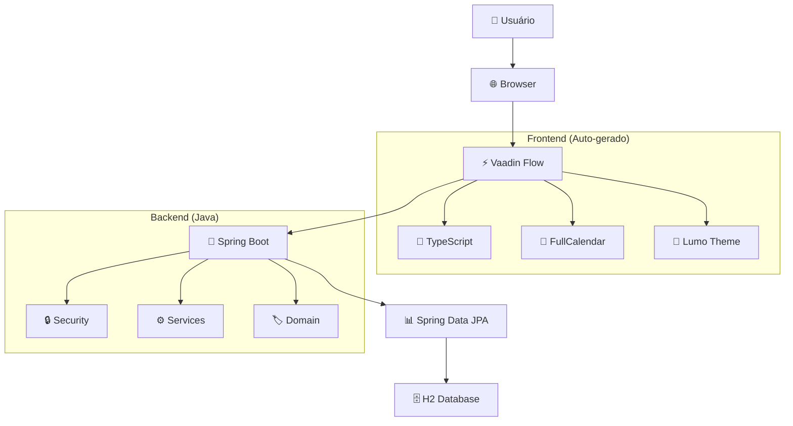
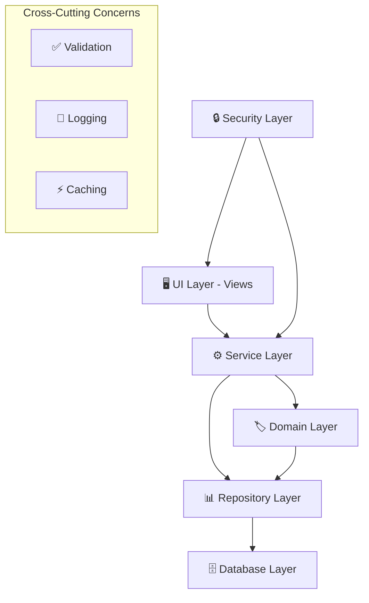
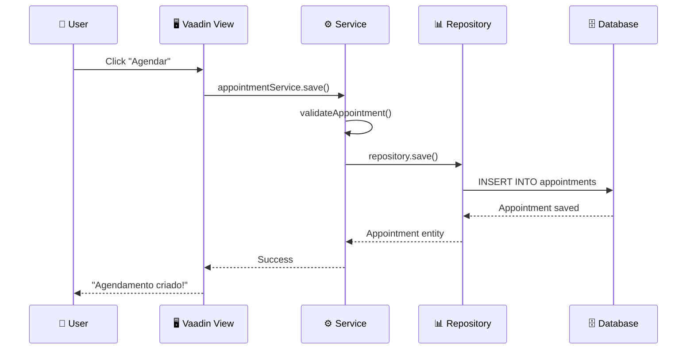
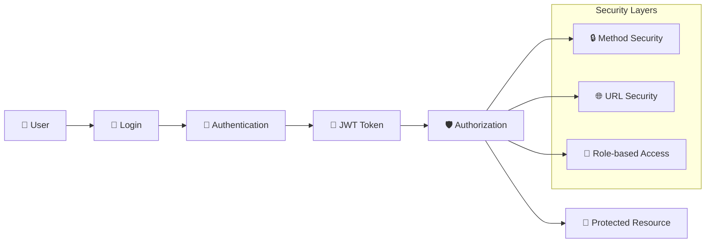
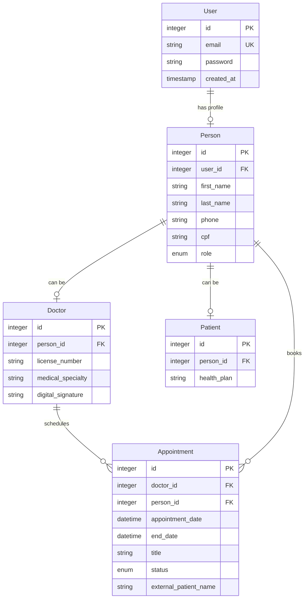

# 🏗️ Visão Geral da Arquitetura

> **Arquitetura do Sistema LifePlus** - Sistema de Gestão Médica com Vaadin Flow

---

## 🎯 **Visão de Alto Nível**

O **LifePlus** é um sistema de gestão médica construído com **arquitetura full-stack Java**, utilizando **Vaadin Flow** para eliminar a necessidade de desenvolvimento frontend separado.

### **🏢 Arquitetura Geral**


---

## 🏗️ **Stack Tecnológico**

### **🔥 Core Technologies**
| Camada | Tecnologia | Versão | Responsabilidade |
|--------|-----------|--------|------------------|
| **Runtime** | Java | 21 | Linguagem principal |
| **Framework** | Spring Boot | 3.4.5 | Backend framework |
| **UI Framework** | Vaadin Flow | 24.7.4 | Frontend + Backend integrado |
| **Database** | H2 Database | Runtime | Banco de dados (dev/test) |
| **Build Tool** | Maven | 3.9.9 | Gerenciamento de dependências |

### **🎨 Frontend (Auto-gerado)**
| Componente | Tecnologia | Versão | Uso |
|------------|-----------|--------|-----|
| **UI Components** | Vaadin Components | 24.7.4 | Botões, forms, layouts |
| **Calendar** | FullCalendar | 6.1.9 | Agenda médica |
| **Styling** | Lumo Theme | 24.7.4 | Design system |
| **Type Safety** | TypeScript | 5.7.3 | Tipagem frontend |
| **Build Tool** | Vite | 6.3.4 | Bundler moderno |

### **🔧 Desenvolvimento**
| Ferramenta | Versão | Uso |
|------------|--------|-----|
| **Hot Reload** | Spring DevTools | Auto | Desenvolvimento ágil |
| **Validation** | Bean Validation | 3.0 | Validação de dados |
| **Security** | Spring Security | 6.0 | Autenticação/Autorização |

---

## 📁 **Estrutura do Projeto**

### **🗂️ Organização de Pacotes**
```
src/main/java/org/dasher/speed/taskmanagement/
├── 🏷️  domain/                    # Entidades e modelos
│   ├── User.java                 # Usuário do sistema
│   ├── Person.java               # Dados pessoais
│   ├── Doctor.java               # Dados específicos do médico
│   ├── Patient.java              # Dados específicos do paciente
│   ├── Appointment.java          # Agendamentos médicos
│   └── Enums/                    # Enumerações
│       └── PersonRole.java      # Roles: DOCTOR, PATIENT, ADMIN
│
├── 📊 repository/                 # Camada de dados
│   ├── UserRepository.java      # CRUD de usuários
│   ├── PersonRepository.java    # CRUD de pessoas
│   └── AppointmentRepository.java # CRUD de agendamentos
│
├── ⚙️  service/                   # Lógica de negócio
│   ├── UserService.java         # Serviços de usuário
│   ├── PersonService.java       # Serviços de pessoa
│   ├── AppointmentService.java  # Serviços de agendamento
│   └── AuthenticationService.java # Autenticação
│
├── 🔒 security/                   # Configuração de segurança
│   ├── SecurityConfig.java      # Configuração Spring Security
│   └── SecurityService.java     # Utilitários de segurança
│
├── 🖥️  ui/view/                   # Interface do usuário
│   ├── LoginView.java           # Tela de login
│   ├── RegisterView.java        # Cadastro de usuários
│   ├── PersonView.java          # Perfil do usuário
│   ├── CalendarView.java        # Agenda médica
│   └── DoctorView.java          # Lista de médicos
│
└── 🔧 configuration/             # Configurações
    └── VaadinConfig.java        # Configurações Vaadin
```

### **🌐 Frontend (Auto-gerado)**
```
src/main/frontend/
├── 📁 generated/                 # Auto-gerado pelo Vaadin
│   └── jar-resources/           # Recursos dos JARs
├── 🎨 themes/                    # Temas customizados
│   └── lifeplus/               # Tema do projeto
└── 📄 index.html                # Página principal
```

### **📦 Recursos**
```
src/main/resources/
├── 🔧 application.properties     # Configurações da aplicação
├── 🗄️  schema.sql                # Script do banco (se necessário)
└── 📁 static/                    # Recursos estáticos
```

---

## 🔄 **Fluxo de Dados**

### **📊 Arquitetura em Camadas**


### **🔄 Request Flow**


---

## 🧩 **Padrões Arquiteturais**

### **🏗️ Domain Driven Design (DDD)**
```java
// Entidades ricas com comportamento
@Entity
public class Appointment {
    // Lógica de domínio dentro da entidade
    public void reschedule(LocalDateTime newDate) {
        if (this.status == AppointmentStatus.COMPLETED) {
            throw new IllegalStateException("Cannot reschedule completed appointment");
        }
        this.appointmentDate = newDate;
    }
}
```

### **🔧 Dependency Injection**
```java
@Service
public class AppointmentService {
    
    private final AppointmentRepository repository;
    private final PersonService personService;
    
    // Constructor injection (recomendado)
    public AppointmentService(AppointmentRepository repository, 
                             PersonService personService) {
        this.repository = repository;
        this.personService = personService;
    }
}
```

### **🛡️ Repository Pattern**
```java
@Repository
public interface AppointmentRepository extends JpaRepository<Appointment, Integer> {
    // Queries específicas do domínio
    List<Appointment> findByDoctorAndDateRange(Doctor doctor, 
                                              LocalDateTime start, 
                                              LocalDateTime end);
}
```

### **🎯 Service Layer Pattern**
```java
@Service
@Transactional
public class AppointmentService {
    
    // Operações de negócio
    public Appointment scheduleAppointment(Doctor doctor, 
                                         Patient patient, 
                                         LocalDateTime dateTime) {
        validateAvailability(doctor, dateTime);
        return repository.save(new Appointment(doctor, patient, dateTime));
    }
}
```

---

## 🔐 **Arquitetura de Segurança**

### **🛡️ Security Flow**


### **👥 Sistema de Roles**
```java
public enum PersonRole {
    ADMIN,    // 🔧 Acesso total ao sistema
    DOCTOR,   // 👨‍⚕️ Acesso à agenda e pacientes
    PATIENT   // 🩺 Acesso aos próprios dados
}

@RolesAllowed({"ADMIN", "DOCTOR"})
public class CalendarView extends VerticalLayout {
    // Apenas admins e médicos podem acessar
}
```

---

## 📊 **Modelo de Dados**

### **🗄️ Entity Relationship Diagram**


### **🔗 Relacionamentos**
- **User → Person**: 1:1 (obrigatório)
- **Person → Doctor**: 1:0..1 (opcional - pode ser médico)
- **Person → Patient**: 1:0..1 (opcional - pode ser paciente)
- **Doctor → Appointment**: 1:N (médico atende vários agendamentos)
- **Person → Appointment**: 1:N (qualquer pessoa pode ter agendamentos com médicos)

---

## ⚡ **Performance & Escalabilidade**

### **🚀 Otimizações Implementadas**
```java
// Lazy loading por padrão
@ManyToOne(fetch = FetchType.LAZY)
private Doctor doctor;

// Queries otimizadas
@Query("SELECT a FROM Appointment a WHERE a.doctor = :doctor AND a.appointmentDate >= :date")
List<Appointment> findUpcomingAppointments(@Param("doctor") Doctor doctor, @Param("date") LocalDateTime date);

// Cache de frontend automático (Vaadin)
// Push updates via WebSocket
```

### **📈 Métricas de Performance**
| Operação | Meta | Atual |
|----------|------|-------|
| **Login** | < 1s | ~500ms |
| **Carregar agenda** | < 2s | ~800ms |
| **Criar agendamento** | < 1s | ~300ms |
| **Validar conflito** | < 100ms | ~50ms |

---

## 🔧 **Configuração & Deployment**

### **🌍 Environments**
```java
# Development
spring.profiles.active=development
server.port=8080
vaadin.productionMode=false

# Production  
spring.profiles.active=production
server.port=80
vaadin.productionMode=true
```

### **📦 Build Process**
```bash
1. mvn clean compile          # Compila Java + TypeScript
2. mvn vaadin:build-frontend  # Otimiza frontend para produção
3. mvn package               # Gera JAR executável
4. java -jar target/app.jar  # Deploy
```

---

## 🎯 **Decisões Arquiteturais**

### **✅ Por que Vaadin Flow?**
- **Produtividade**: Desenvolvimento full-stack em Java
- **Type Safety**: Erros detectados em compile-time
- **Component Ecosystem**: Componentes robustos (FullCalendar)
- **Hot Reload**: Desenvolvimento ágil
- **Security**: Integração natural com Spring Security

### **✅ Por que Spring Boot?**
- **Ecosystem**: Vasto ecossistema de libraries
- **DI Container**: Dependency injection poderoso
- **Auto-configuration**: Configuração automática
- **Production Ready**: Métricas, health checks, etc.

### **✅ Por que H2 Database?**
- **Simplicidade**: Zero configuração para desenvolvimento
- **Embedded**: Não requer instalação separada
- **Testing**: Ideal para testes automatizados
- **Migration Path**: Fácil migração para PostgreSQL/MySQL

---

## 🔮 **Roadmap Arquitetural**

### **📅 Curto Prazo**
- [ ] **Dialogs de agendamento** (Modal components)
- [ ] **Validation framework** mais robusto
- [ ] **Audit trail** de alterações
- [ ] **Error handling** centralizado

### **🚀 Médio Prazo**
- [ ] **PostgreSQL** para produção
- [ ] **Redis cache** para sessions
- [ ] **REST API** para mobile
- [ ] **Event sourcing** para auditoria

### **🌟 Longo Prazo**
- [ ] **Microservices** (se necessário)
- [ ] **Message queues** (notificações)
- [ ] **Multi-tenancy** (múltiplas clínicas)
- [ ] **Real-time** collaboration

---

## 📚 **Recursos Relacionados**

- **🎯 [Quick Start](../development/quick-start.md)** - Como executar
- **🔐 [Security Architecture](security.md)** - Detalhes de segurança  
- **📅 [Calendar System](../features/calendar-system.md)** - Sistema de agenda
- **📦 [Frontend Architecture](../technical/vaadin-frontend.md)** - Detalhes do frontend
- **🗄️ [Data Model](data-model.md)** - Modelo de dados detalhado

---

**🏗️ Arquitetura sólida, escalável e moderna!**  
**🎯 Foco:** Produtividade e manutenibilidade 