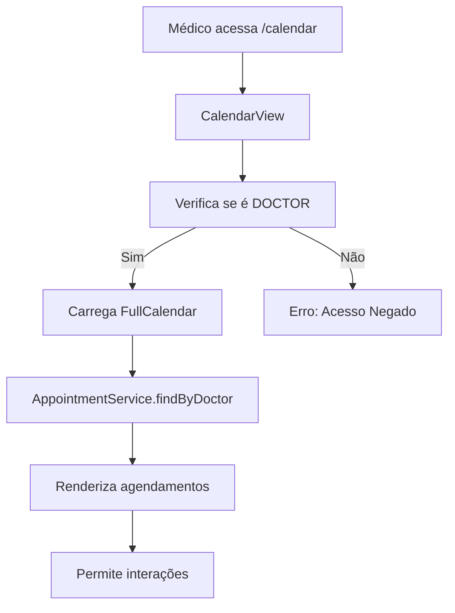
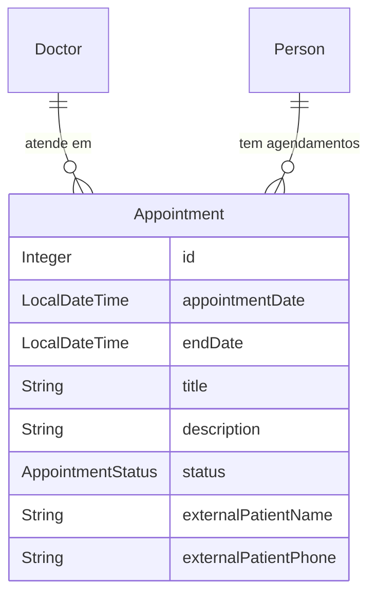

# 📅 Sistema de Agenda Médica

> **Sistema completo de agendamento médico** integrado com FullCalendar

---

## 🎯 **Visão Geral**

O sistema de agenda médica permite que **médicos** gerenciem seus agendamentos de forma visual e intuitiva, oferecendo:

- **📅 Calendário visual** com diferentes visualizações
- **⏰ Gestão de horários** com detecção de conflitos
- **👥 Vinculação com pacientes** cadastrados ou avulsos
- **📊 Status de agendamentos** (agendado, confirmado, concluído, etc.)
- **🔒 Segurança por roles** (apenas médicos acessam)

---

## 🏗️ **Arquitetura do Sistema**

### **📊 Diagrama de Fluxo**


### **🗄️ Modelo de Dados**


---

## 🛠️ **Componentes Implementados**

### **1️⃣ Entidade Appointment**
```java
@Entity
@Table(name = "appointments")
public class Appointment {
    @Id
    @GeneratedValue(strategy = GenerationType.IDENTITY)
    private Integer id;
    
    @NotNull
    @Column(name = "appointment_date")
    private LocalDateTime appointmentDate;
    
    @NotNull
    @Column(name = "end_date")
    private LocalDateTime endDate;
    
    @Enumerated(EnumType.STRING)
    private AppointmentStatus status;
    
    @ManyToOne(fetch = FetchType.LAZY)
    @JoinColumn(name = "doctor_id", nullable = false)
    private Doctor doctor;
    
    @ManyToOne(fetch = FetchType.LAZY)
    @JoinColumn(name = "patient_id")
    private Patient patient;
    
    // Campos para pacientes não cadastrados
    private String patientName;
    private String patientPhone;
}
```

### **2️⃣ Status de Agendamento**
```java
public enum AppointmentStatus {
    SCHEDULED("Agendado"),      // 🔵 Azul
    CONFIRMED("Confirmado"),    // 🟢 Verde  
    IN_PROGRESS("Em andamento"), // 🟠 Laranja
    COMPLETED("Concluído"),     // ⚫ Cinza
    CANCELLED("Cancelado"),     // 🔴 Vermelho
    NO_SHOW("Não compareceu")   // 🤎 Marrom
}
```

### **3️⃣ Repository com Queries Inteligentes**
```java
@Repository
public interface AppointmentRepository extends JpaRepository<Appointment, Integer> {
    
    // Buscar por médico em período
    List<Appointment> findByDoctorAndDateRange(
        @Param("doctor") Doctor doctor,
        @Param("startDate") LocalDateTime startDate,
        @Param("endDate") LocalDateTime endDate
    );
    
    // Detectar conflitos de horário
    List<Appointment> findConflictingAppointments(
        @Param("doctor") Doctor doctor,
        @Param("startTime") LocalDateTime startTime,
        @Param("endTime") LocalDateTime endTime,
        @Param("excludeId") Integer excludeId
    );
}
```

### **4️⃣ Service com Validações**
```java
@Service
public class AppointmentService {
    
    public void validateAppointment(Appointment appointment) {
        // Validar datas
        if (appointment.getAppointmentDate().isAfter(appointment.getEndDate())) {
            throw new IllegalArgumentException("Data de início deve ser anterior à data de fim");
        }
        
        // Verificar conflitos
        if (hasConflictingAppointments(appointment.getDoctor(), 
                                     appointment.getAppointmentDate(), 
                                     appointment.getEndDate(), 
                                     appointment.getId())) {
            throw new IllegalArgumentException("Já existe um agendamento neste horário");
        }
    }
}
```

### **5️⃣ CalendarView com FullCalendar**
```java
@Route("calendar")
@PageTitle("Agenda Médica | LifePlus")
@RolesAllowed({"USER", "ADMIN", "DOCTOR"})
public class CalendarView extends VerticalLayout {
    
    private FullCalendar calendar;
    private Doctor currentDoctor;
    
    private void setupCalendar() {
        calendar = FullCalendarBuilder.create().build();
        calendar.changeView(CalendarViewImpl.DAY_GRID_MONTH);
        
        // Clique em agendamentos existentes
        calendar.addEntryClickedListener(event -> {
            // Abrir dialog de edição
        });
        
        // Clique em datas vazias (novo agendamento)
        calendar.addTimeslotClickedListener(event -> {
            openNewAppointmentDialog(event.getDate());
        });
    }
}
```

---

## 🎨 **Interface do Usuário**

### **📱 Layout Responsivo**
```
┌─────────────────────────────────────┐
│ 🏥 LifePlus - Agenda Médica        │
├─────────────────────────────────────┤
│ [Novo Agendamento] [Hoje] [Semana] │
├─────────────────────────────────────┤
│        📅 JUNHO 2025               │
│ Dom Seg Ter Qua Qui Sex Sab        │
│  1   2   3   4   5   6   7         │
│  8   9 🟢10 🔵11  12  13  14        │
│ 15  16  17 🟠18  19  20  21        │
│ 22  23  24  25  26  27  28        │
│ 29  30                            │
└─────────────────────────────────────┘
```

### **🎨 Cores por Status**
| Status | Cor | Hex | Uso |
|--------|-----|-----|-----|
| **Agendado** | 🔵 Azul | `#2196F3` | Agendamento inicial |
| **Confirmado** | 🟢 Verde | `#4CAF50` | Paciente confirmou |
| **Em andamento** | 🟠 Laranja | `#FF9800` | Consulta happening |
| **Concluído** | ⚫ Cinza | `#9E9E9E` | Finalizado |
| **Cancelado** | 🔴 Vermelho | `#F44336` | Cancelado |
| **Não compareceu** | 🤎 Marrom | `#795548` | No-show |

---

## 🔧 **Funcionalidades Implementadas**

### ✅ **Funcionalidades Básicas**
- [x] **Visualização mensal** do calendário
- [x] **Carregamento de agendamentos** por médico
- [x] **Cores por status** de agendamento
- [x] **Segurança por role** (apenas doctors)
- [x] **Clique em agendamentos** existentes
- [x] **Clique em datas vazias** para novo agendamento
- [x] **Validação de conflitos** de horário
- [x] **Suporte a pacientes** cadastrados ou avulsos

### 🚧 **Em Desenvolvimento**
- [ ] **Dialog de criação** de agendamento
- [ ] **Dialog de edição** de agendamento
- [ ] **Visualizações** semanal e diária
- [ ] **Drag & drop** de agendamentos
- [ ] **Redimensionar** agendamentos
- [ ] **Busca de pacientes** no dialog
- [ ] **Notificações** de lembrete

### 🎯 **Roadmap Futuro**
- [ ] **Recorrência** de agendamentos
- [ ] **Integração com email** (confirmações)
- [ ] **Relatórios** de agenda
- [ ] **Sincronização** com calendários externos
- [ ] **Agenda para pacientes** (visualização)
- [ ] **Sistema de filas** de espera

---

## 🚀 **Como Usar**

### **👨‍⚕️ Para Médicos**

#### **1️⃣ Acessar a Agenda**
```bash
1. Faça login como usuário com role DOCTOR
2. Acesse: http://localhost:8080/calendar
3. A agenda carregará automaticamente seus agendamentos
```

#### **2️⃣ Criar Novo Agendamento**
```bash
1. Clique em "Novo Agendamento" OU
2. Clique em uma data vazia no calendário
3. [EM DESENVOLVIMENTO] Dialog de criação abrirá
```

#### **3️⃣ Visualizar Agendamento**
```bash
1. Clique em um agendamento colorido
2. [ATUAL] Mostra informações em notificação
3. [FUTURO] Dialog de edição completo
```

---

## 🔐 **Segurança**

### **🛡️ Controle de Acesso**
```java
@RolesAllowed({"USER", "ADMIN", "DOCTOR"})
public class CalendarView extends VerticalLayout {
    
    private void loadCurrentDoctor() {
        // Só permite acesso se:
        // 1. Usuário autenticado
        // 2. Tem Person associado
        // 3. Person.role == DOCTOR
        // 4. Doctor entity existe
        
        if (currentPerson.getRole() != PersonRole.DOCTOR) {
            showErrorNotification("Acesso negado: Esta funcionalidade é apenas para médicos");
            newAppointmentButton.setEnabled(false);
        }
    }
}
```

### **🔒 Isolamento de Dados**
- Cada médico vê **apenas seus próprios** agendamentos
- Queries sempre filtram por `doctor_id`
- Não há acesso cross-doctor sem autorização

---

## 📊 **Performance**

### **⚡ Otimizações Implementadas**
- **Lazy Loading**: `@ManyToOne(fetch = FetchType.LAZY)`
- **Queries específicas**: Busca só o período necessário
- **Cache de frontend**: FullCalendar mantém eventos carregados
- **Validação no service**: Evita roundtrips desnecessários

### **📈 Métricas Esperadas**
- **Carregamento inicial**: < 2 segundos
- **Mudança de mês**: < 500ms
- **Criação de agendamento**: < 1 segundo
- **Validação de conflito**: < 100ms

---

## 🧪 **Testando o Sistema**

### **🎯 Cenários de Teste**

#### **Teste 1: Acesso Básico**
```bash
1. Login como médico
2. Acesse /calendar
3. ✅ Calendário deve carregar
4. ✅ Botão "Novo Agendamento" deve estar visível
```

#### **Teste 2: Agendamentos Existentes**
```bash
1. Crie agendamentos via código/SQL
2. Refresh da página
3. ✅ Agendamentos devem aparecer com cores corretas
```

#### **Teste 3: Segurança**
```bash
1. Login como paciente
2. Acesse /calendar
3. ✅ Deve mostrar "Acesso negado"
```

### **🗄️ Dados de Teste**
```sql
-- Criar agendamento de teste
INSERT INTO appointments (appointment_date, end_date, title, status, doctor_id, patient_name) 
VALUES ('2025-06-15 09:00:00', '2025-06-15 10:00:00', 'Consulta de rotina', 'SCHEDULED', 1, 'João Silva');
```

---

## 🐛 **Troubleshooting**

### **❌ Problema: Calendar não carrega**
```bash
Causa: FullCalendar dependencies não baixadas
Solução: mvn vaadin:clean-frontend vaadin:prepare-frontend
```

### **❌ Problema: "Médico não encontrado"**
```bash
Causa: User logado não tem Person.role = DOCTOR
Solução: 
1. Acesse /person
2. Configure role como "Médico"
3. Salve e acesse /calendar novamente
```

### **❌ Problema: Agendamentos não aparecem**
```bash
Causa: Não há Doctor entity para o Person
Solução: 
1. No PersonView, configure como Doctor
2. Dados específicos do médico serão criados
```

---

## 🔗 **Integrações Futuras**

### **📧 Email/SMS**
```java
// Futuro: Notificações automáticas
@Service
public class NotificationService {
    public void sendAppointmentConfirmation(Appointment appointment) {
        // Enviar email/SMS para paciente
    }
}
```

### **📱 Mobile API**
```java
// Futuro: REST API para app mobile
@RestController
@RequestMapping("/api/calendar")
public class CalendarApiController {
    
    @GetMapping("/doctor/{doctorId}/appointments")
    public List<AppointmentDTO> getAppointments(@PathVariable Integer doctorId) {
        // API para apps móveis
    }
}
```

### **📊 Relatórios**
```java
// Futuro: Dashboards e relatórios
public class CalendarReportsService {
    public MonthlyReportDTO generateMonthlyReport(Doctor doctor, YearMonth month) {
        // Relatórios de produtividade
    }
}
```

---

## 📚 **Documentação Relacionada**

- **🏗️ [Arquitetura Backend](../architecture/backend.md)** - Como o sistema funciona
- **🔐 [Segurança](../architecture/security.md)** - Sistema de roles
- **👥 [Gestão de Usuários](user-management.md)** - Como configurar médicos
- **📦 [FullCalendar Integration](../technical/npm-dependencies.md)** - Detalhes técnicos
- **🧪 [Testing Guide](../development/testing.md)** - Como testar

---

**📅 Sistema implementado e funcionando!**  
**🎯 Próximo:** Implementar dialogs de criação/edição de agendamentos 