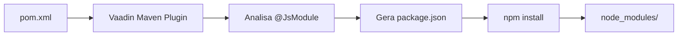

# 📦 Package.json & NPM Dependencies Explained

> **Explicação detalhada** dos arquivos JavaScript/NPM que surgiram no projeto

---

## 🎯 **Visão Geral**

Quando você adicionou o **FullCalendar** ao `pom.xml`, o Vaadin automaticamente criou toda uma infraestrutura frontend. Aqui está **tudo explicado**:

---

## 📁 **Arquivos Criados**

### **🔗 Relação Maven ↔ NPM**


---

## 📦 **package.json Detalhado**

### **📋 Metadados Básicos**
```json
{
  "name": "no-name",           // Nome do projeto frontend
  "license": "UNLICENSED",     // Licença (para uso interno)
  "type": "module"             // Usa ES Modules (padrão moderno)
}
```

### **🔗 Dependências Principais**

#### **📅 FullCalendar (Sua agenda médica)**
```json
{
  "@fullcalendar/core": "6.1.9",           // Motor principal
  "@fullcalendar/daygrid": "6.1.9",        // Visualização mensal
  "@fullcalendar/timegrid": "6.1.9",       // Visualização semanal/diária
  "@fullcalendar/interaction": "6.1.9",    // Drag & drop, cliques
  "@fullcalendar/list": "6.1.9",          // Visualização em lista
  "@fullcalendar/moment": "6.1.9",         // Formatação de datas
  "@fullcalendar/multimonth": "6.1.9"      // Múltiplos meses
}
```

**Por que tantos módulos?**  
O FullCalendar é **modular** - você só carrega o que usa. Isso otimiza performance.

#### **⚡ Vaadin Core**
```json
{
  "@vaadin/bundles": "24.7.6",                    // Componentes Vaadin
  "@vaadin/react-components": "24.7.6",           // Suporte React (futuro)
  "@vaadin/vaadin-lumo-styles": "24.7.6",        // Tema Lumo (Material Design)
  "@vaadin/vaadin-material-styles": "24.7.6",    // Tema Material
  "@polymer/polymer": "3.5.2"                     // Base para Web Components
}
```

#### **🛠️ Ferramentas de Build**
```json
{
  "typescript": "5.7.3",                    // Compilador TypeScript
  "vite": "6.3.4",                         // Build tool moderno
  "@vitejs/plugin-react": "4.4.1",         // Suporte React
  "rollup-plugin-brotli": "3.1.0"          // Compressão
}
```

---

## 🗂️ **Estrutura de Arquivos Frontend**

### **📁 Diretórios Criados**
```
projeto/
├── package.json              # Dependências NPM
├── package-lock.json         # Versões exatas (lock)
├── tsconfig.json            # Configuração TypeScript
├── types.d.ts               # Definições de tipos
├── node_modules/            # Bibliotecas baixadas
└── src/main/frontend/       # Código frontend customizado
    ├── generated/           # Auto-gerado pelo Vaadin
    ├── themes/              # Temas customizados
    └── index.html           # Página principal
```

---

## 📋 **types.d.ts Explicado**

### **🎯 O que faz:**
```typescript
// Permite importar CSS como módulos TypeScript
declare module '*.css?inline' {
  import type { CSSResultGroup } from 'lit';
  const content: CSSResultGroup;
  export default content;
}
```

**Tradução:** "TypeScript, quando vir `import './style.css?inline'`, trate como um módulo válido que retorna CSS."

### **🔧 CSS Custom Properties**
```typescript
declare module 'csstype' {
  interface Properties {
    [index: `--${string}`]: any;  // Permite --minha-variavel-css
  }
}
```

**Tradução:** "Aceite qualquer propriedade CSS que comece com `--`"

---

## ⚙️ **tsconfig.json Explicado**

### **🎯 Configurações Principais**
```json
{
  "compilerOptions": {
    "target": "es2022",              // JavaScript moderno
    "module": "esNext",              // Módulos ES6+
    "jsx": "react-jsx",              // Suporte React
    "moduleResolution": "bundler",   // Como resolver imports
    "strict": true,                  // TypeScript rigoroso
    "baseUrl": "src/main/frontend"   // Raiz dos imports
  }
}
```

### **📁 Mapeamento de Caminhos**
```json
{
  "paths": {
    "@vaadin/flow-frontend": ["generated/jar-resources"],
    "@vaadin/flow-frontend/*": ["generated/jar-resources/*"],
    "Frontend/*": ["*"]
  }
}
```

**Tradução:** 
- `@vaadin/flow-frontend` → `src/main/frontend/generated/jar-resources`
- `Frontend/myfile` → `src/main/frontend/myfile`

---

## 🔄 **Como Funciona o Build**

### **🏗️ Processo Completo**
```bash
1. mvn compile
   ↓
2. Vaadin analisa anotações Java (@JsModule, etc.)
   ↓
3. Gera package.json com dependências necessárias
   ↓
4. Executa npm install (baixa node_modules/)
   ↓
5. TypeScript compila → JavaScript
   ↓
6. Vite bundifica tudo
   ↓
7. Resultado: aplicação pronta
```

### **📦 O que vai para produção:**
```
target/classes/META-INF/VAADIN/
├── webapp/                    # JavaScript bundificado
├── config/                    # Configurações
└── build/                     # Assets otimizados
```

---

## 🎯 **Seção Vaadin no package.json**

### **🔐 Seção Especial**
```json
{
  "vaadin": {
    "dependencies": { ... },      // Dependências gerenciadas pelo Vaadin
    "devDependencies": { ... },   // Ferramentas de desenvolvimento
    "hash": "655e433aa..."        // Hash para cache
  }
}
```

**Por que duplicado?**  
- **`dependencies`**: NPM padrão
- **`vaadin.dependencies`**: Controle do Vaadin (cache, versioning)

### **🔒 Overrides**
```json
{
  "overrides": {
    "@vaadin/bundles": "$@vaadin/bundles",    // Força versão específica
    "react": "$react"                         // Evita conflitos
  }
}
```

**Tradução:** "Use sempre a versão que EU especifiquei, não resolva automaticamente"

---

## 🚀 **Comandos Úteis**

### **🔍 Debug Dependencies**
```bash
# Ver árvore de dependências
npm list

# Ver outdated
npm outdated

# Ver informações de um pacote
npm info @fullcalendar/core
```

### **🧹 Limpeza**
```bash
# Limpar cache NPM
npm cache clean --force

# Reinstalar tudo
rm -rf node_modules package-lock.json
mvn vaadin:prepare-frontend
```

### **📊 Análise de Bundle**
```bash
# Ver tamanho dos módulos
npm install -g webpack-bundle-analyzer
mvn vaadin:build-frontend
npx webpack-bundle-analyzer target/classes/META-INF/VAADIN/webapp/VAADIN/build/
```

---

## ❗ **Troubleshooting**

### **🚫 Problema: "Module not found"**
```bash
# Solução: Recriar frontend
mvn vaadin:clean-frontend vaadin:prepare-frontend
```

### **🚫 Problema: Versões conflitantes**
```bash
# Solução: Forçar reinstalação
rm -rf node_modules package-lock.json
mvn clean install
```

### **🚫 Problema: Build lento**
```bash
# Solução: Usar modo desenvolvimento
mvn spring-boot:run -Dvaadin.productionMode=false
```

---

## 🎯 **Customizações Avançadas**

### **🎨 Adicionando CSS Global**
```typescript
// src/main/frontend/themes/mytheme/styles.css
.my-calendar {
  --fc-today-bg-color: #e3f2fd;
}
```

### **📦 Adicionando Bibliotecas**
```java
// Na sua View Java
@JsModule("./my-custom-script.js")
@CssImport("./themes/mytheme/calendar-theme.css")
public class CalendarView extends VerticalLayout {
    // ...
}
```

### **⚡ Otimizações**
```json
// package.json customizado
{
  "vaadin": {
    "optimizeBundle": true,
    "bundleCompression": "brotli"
  }
}
```

---

## 📚 **Recursos Adicionais**

- **📖 [Vaadin Frontend Architecture](vaadin-frontend.md)** - Arquitetura completa
- **🏗️ [Build Process](../deployment/build.md)** - Processo de build detalhado
- **🎨 [Theming Guide](themes-customization.md)** - Customizar aparência
- **🔧 [Advanced Configuration](configurations.md)** - Configurações avançadas

---

**💡 Resumo:** O Vaadin automatiza todo o frontend, mas você tem controle total quando necessário! 